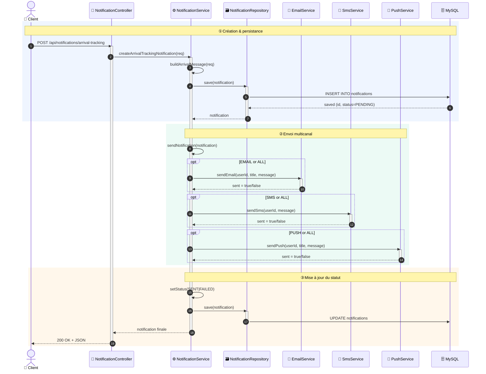

# 📧 Microservice de Notifications – Suivi d’Arrivée

## 🎯 Description
Microservice Spring Boot chargé d’émettre des notifications de suivi d’arrivée aux clients d’une plate-forme de transport de marchandises.  
Il s’intègre dans une architecture micro-services et envoie les alertes par **e-mail**, **SMS** et **push** (multicanal).

---

## 🛠️ Stack technique
| Technologie | Version / Remarque |
|-------------|--------------------|
| Java | 17 (LTS) |
| Spring Boot | 3.5.4 |
| Spring Data JPA | Persistance |
| Spring Mail | Envoi d’e-mails |
| MySQL | Base de production |
| Lombok | Réduction du boiler-plate |
| Maven | 3.9+ |
| Git | Versionning |

---

## Fonctionnalités

| Fonctionnalité | Détails |
|---------------|---------|
| 🚚 **Alerte « colis en approche »** | Diffusion en *temps-réel* dès que le chauffeur entre dans la zone de livraison. |
| 📬 **Multi-canal** | Un seul appel ➜ e-mail **ET/OU** SMS **ET/OU** push (ou `ALL` pour tout d’un coup). |
| 🔄 **Workflow transparent** | Statuts automatisés : `PENDING` ➜ `SENT` ✔ ou `FAILED` ❌ (avec retry programmé). |
| 🎯 **API REST hyper-propre** | Endpoints auto-documentés via OpenAPI 3 + DTOs validés. |
| 🗃️ **Persistance fiable** | MySQL en prod, scripts Flyway, indices optimisés. |
| 🔧 **Config externalisée** | Profils `dev` (H2) & `prod` (MySQL) switchables en 1 variable. |

---

## 🚀 Démarrage rapide
Le service écoute sur **http://localhost:8082**

---

## 📦 Installation complète

### 1. Prérequis
```bash
# Ubuntu / Debian
sudo apt update
sudo apt install openjdk-17-jdk maven mysql-server -y
```

### 2. Base MySQL
```sql
CREATE DATABASE transport_db CHARACTER SET utf8mb4;
CREATE USER 'transport'@'localhost' IDENTIFIED BY 'Ch@ng3M3!';
GRANT ALL PRIVILEGES ON transport_db.* TO 'transport'@'localhost';
FLUSH PRIVILEGES;
```
---

## 🔧 Structure du projet
```
transport/
└── notifications/
    ├── NotificationsApplication.java
    ├── controller/
    │   └── NotificationController.java
    ├── dto/
    │   └── NotificationRequest.java
    ├── model/
    │   └── Notification.java
    ├── repository/
    │   └── NotificationRepository.java
    └── service/
        ├── NotificationService.java
        ├── EmailService.java
        ├── SmsService.java
        └── PushNotificationService.java
```

---

## 📡 Endpoints REST
Base : `http://localhost:8082/api/notifications`

| Méthode | URL | Description | Body JSON |
|---------|-----|-------------|-----------|
| **POST** | `/arrival-tracking` | Créer + envoyer une notification | [voir ci-dessous](#exemple-de-requête) |
| **GET**  | `/user/{userId}` | Lister les notifications d’un utilisateur | - |
| **GET**  | `/status/{status}` | Filtrer par statut (`PENDING`, `SENT`, `FAILED`) | - |

### Exemple de requête
```json
POST /api/notifications/arrival-tracking
Content-Type: application/json

{
  "userId": "client@demo.com",
  "title": "Votre colis arrive",
  "message": "Livraison estimée dans 30 min",
  "channel": "EMAIL",
  "transportRequestId": "TR-2024-001",
  "estimatedArrivalTime": "2024-09-09T16:30:00"
}
```
Réponse : `200 OK` + objet `Notification` créé.

---

## 🧪 Tester l’API

### cURL
```bash
curl -X POST http://localhost:8082/api/notifications/arrival-tracking \
  -H "Content-Type: application/json" \
  -d '{"userId":"test@demo.com","title":"Test","message":"Hello","channel":"EMAIL","transportRequestId":"TEST-001"}'
```

### PowerShell
```powershell
$body = @{
    userId = "test@demo.com"
    title  = "Test"
    message = "Hello depuis PowerShell"
    channel = "ALL"
    transportRequestId = "PS-001"
} | ConvertTo-Json

Invoke-RestMethod -Uri http://localhost:8082/api/notifications/arrival-tracking -Method Post -Body $body -ContentType "application/json"
```

---

## 📧 Configuration e-mail (Gmail)

1. Activez **l’authentification à 2 facteurs** sur votre compte Google.  
2. Générez un **mot de passe d’application** :  
   https://myaccount.google.com/apppasswords  
3. Renseignez-le dans `application-prod.properties` :

```properties
spring.mail.host=smtp.gmail.com
spring.mail.port=587
spring.mail.username=s.eraji@edu.umi.ac.ma
spring.mail.password=${MAIL_PASSWORD}
spring.mail.properties.mail.smtp.auth=true
spring.mail.properties.mail.smtp.starttls.enable=true
spring.mail.properties.mail.smtp.starttls.required=true
```

---

## 🗄️ Configuration base de données

### Profil `dev` (H2 embarquée)
```properties
spring.datasource.url=jdbc:h2:mem:transport_db
spring.datasource.driverClassName=org.h2.Driver
spring.datasource.username=sa
spring.datasource.password=
spring.jpa.database-platform=org.hibernate.dialect.H2Dialect
spring.h2.console.enabled=true
```

### Profil `prod` (MySQL)
```properties
spring.datasource.url=jdbc:mysql://localhost:3306/transport_db
spring.datasource.username=transport
spring.datasource.password=${DB_PASSWORD}
spring.datasource.driver-class-name=com.mysql.cj.jdbc.Driver
spring.jpa.hibernate.ddl-auto=validate
spring.jpa.properties.hibernate.dialect=org.hibernate.dialect.MySQLDialect
```

---

## 🔐 Sécurité des secrets
- Utilisez les **variables d’environnement** ou Spring Cloud Config Server.  
- Ajoutez `application-prod.properties` à `.gitignore`.  
- Fournissez un template :
```properties
spring.mail.password=${MAIL_PASSWORD:changeme}
spring.datasource.password=${DB_PASSWORD:changeme}
```

---

## 📸 Captures d’écran
*(à ajouter dans `/screenshots`)*  
- `architecture.png` – diagramme micro-services  
- `api-response.png` – réponse Swagger / Postman  
- `h2-console.png` – consultation des notifications  
- `email-received.png` – rendu dans la boîte mail
---


**Safae ERAJI** – s.eraji@edu.umi.ac.ma
