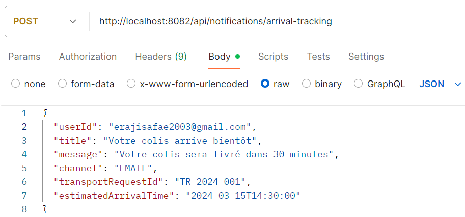
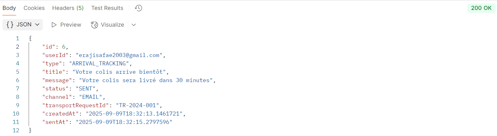
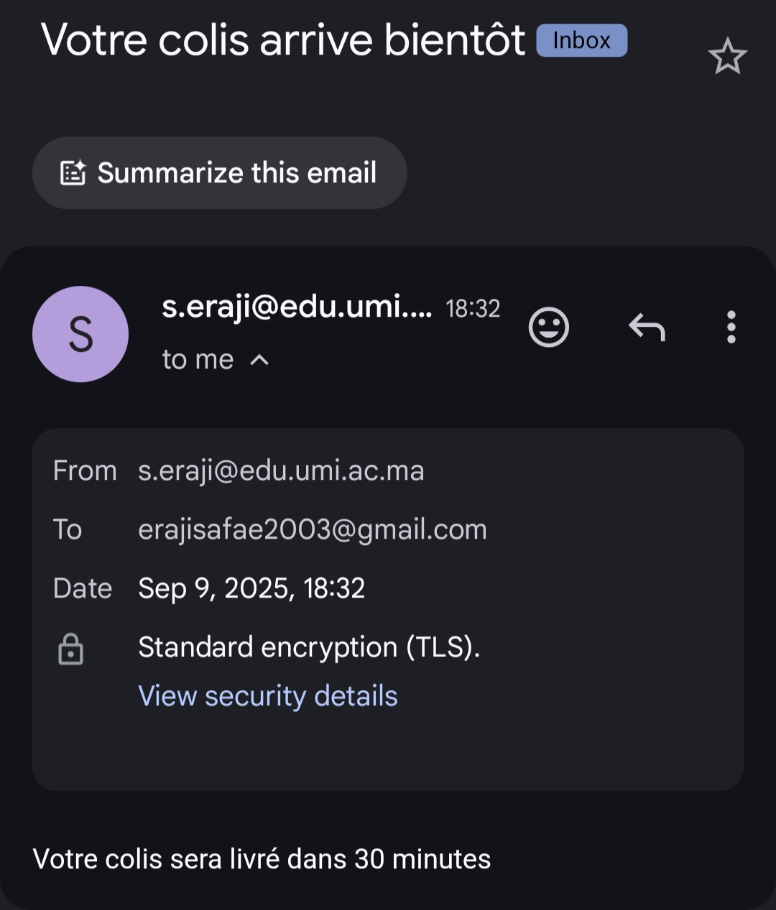
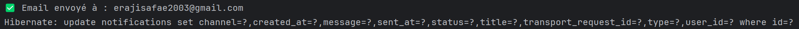
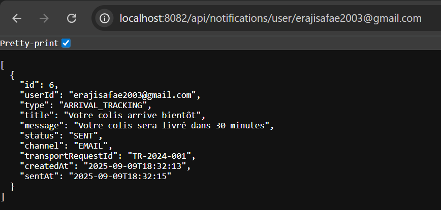
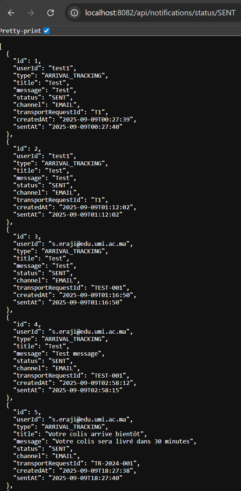

# 📧 Microservice de Suivi d'Arrivée - Notifications

## 📋 Description
Ce microservice fait partie d'une plateforme d'optimisation du transport de marchandises, il est chargé d’émettre des notifications de suivi d’arrivée aux clients. Il permet d'informer les utilisateurs de l'état d'avancement de leurs livraisons via différents canaux de communication **e-mail**, **SMS** et **push**.

---

## Fonctionnalités Implémentées

| Fonctionnalité | Détails |
|---------------|---------|
| 🚚 **Alerte « colis en approche »** | Diffusion en *temps-réel* dès que le chauffeur entre dans la zone de livraison. |
| **Multi-canal** | Un seul appel ➜ e-mail📧 **ET/OU** SMS📱 **ET/OU** push🔔 (ou `ALL`🌐 pour tout d’un coup). |
| 🔄 **Gestion des statuts de notification** | Statuts automatisés : `PENDING` ➜ `SENT` ✔ ou `FAILED` ❌ (avec retry programmé). |
| **Historique** | Historique des notifications par utilisateur. |
| **Filtrage des notifications** | par statut. |
| **Personnalisation des messages** | Personnalisation des messages avec informations de livraison. |
| 🔧 **Config externalisée** | Profils `dev` (H2) & `prod` (MySQL) switchables en 1 variable. |

---

## 🛠️ Stack technique
| Technologie | Version / Remarque |
|-------------|--------------------|
| Java | Avec Spring Boot |
| Spring Data JPA | Persistance des données |
| Spring Mail | Envoi d’e-mails |
| MySQL | Base de production |
| Lombok | Réduction du CODE boiler-plate |
| Maven | Gestion des dépendances |
| Git | Versionning |

---

## 🔧 Structure du projet
```
notifications/
├── src/main/java/transport/notifications/
│   ├── controller/NotificationController.java
│   ├── dto/NotificationRequest.java
│   ├── model/Notification.java
│   ├── repository/NotificationRepository.java
│   ├── service/
│   │   ├── NotificationService.java
│   │   ├── EmailService.java
│   │   ├── SmsService.java
│   │   └── PushNotificationService.java
│   └── NotificationsApplication.java
├── src/main/resources/
│   └── application.properties
└── pom.xml
```

---

## Base données MySQL 🗄️
```sql
CREATE DATABASE transport_db 
CHARACTER SET utf8mb4 
COLLATE utf8mb4_unicode_ci;
```
---

## application.properties

### Profil `dev` (H2)
```properties
spring.datasource.url=jdbc:h2:mem:transport_db
spring.datasource.driverClassName=org.h2.Driver
spring.datasource.username=sa
spring.datasource.password=
spring.jpa.database-platform=org.hibernate.dialect.H2Dialect
spring.h2.console.enabled=true
```

### Profil `prod` (MySQL)
```properties
spring.datasource.url=jdbc:mysql://localhost:3306/transport_db
spring.datasource.username=root
spring.datasource.password=${PASSWORD}
spring.datasource.driver-class-name=com.mysql.cj.jdbc.Driver
spring.jpa.hibernate.ddl-auto=validate
spring.jpa.properties.hibernate.dialect=org.hibernate.dialect.MySQLDialect
```

### 📧 Configuration e-mail (Gmail)

1. Activez **l’authentification à 2 facteurs** sur votre compte Google.  
2. Générez un **mot de passe d’application** :  
   https://myaccount.google.com/apppasswords  
3. Renseignez-le dans `application-prod.properties` :

```properties
spring.mail.host=smtp.gmail.com
spring.mail.port=587
spring.mail.username=YOUR_EMAIL
spring.mail.password=${MAIL_PASSWORD}
spring.mail.properties.mail.smtp.auth=true
spring.mail.properties.mail.smtp.starttls.enable=true
spring.mail.properties.mail.smtp.starttls.required=true
```

---

## 🚀 Démarrage rapide
Le service écoute sur **http://localhost:8082**

---

## 🔌 API Endpoints - Postman



Réponse : `200 OK` + objet `Notification` créé.


Rendu dans la boîte mail :


Console :


---

### 📡 Endpoints REST
Base : `http://localhost:8082/api/notifications`

| Méthode | URL | Description | Body JSON |
|---------|-----|-------------|-----------|
| **POST** | `/arrival-tracking` | Créer + envoyer une notification |
| **GET**  | `/user/{userId}` | Lister les notifications d’un utilisateur | 
| **GET**  | `/status/{status}` | Filtrer par statut (`PENDING`, `SENT`, `FAILED`) |

#### Exemples de GET

Notifications d’un utilisateur :


Filtre par statut (SENT) :




Pour le moment, les services **SMS** et **Push** s'affichent juste dans la console. Si nous voulons les intégrer, on utilise : API Twilio, Vonage,.. pour SMS, et Firebase Cloud Messaging (FCM) pour Android/iOS concernant le Push.

---

**Safae ERAJI**
